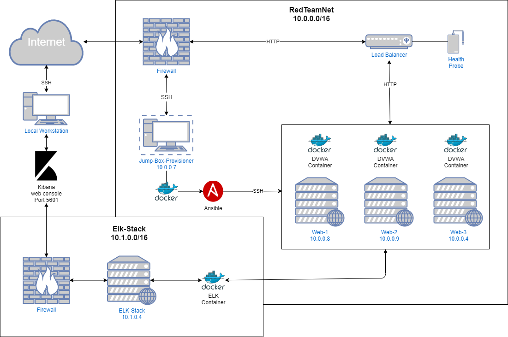
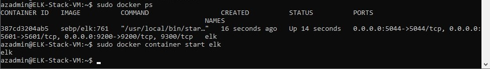

## Automated ELK Stack Deployment

The files in this repository were used to configure the network depicted below.

  

[Network Information](Images/NetworkValues.md)  
[Firewall Rules](Images/FirewallRules.md)  

These files have been tested and used to generate a live ELK deployment on Azure. They can be used to recreate the entire deployment pictured above.
Alternatively, select portions of the configuration files may be used to install only certain pieces of it, such as Filebeat.

[Web Server DVWA setup YAML](Scripts/configure-webserver.yml)  
[ELK Stack setup YAML](Scripts/install-elk.yml)  
[Filebeat setup YAML](Scripts/filebeat-playbook.yml)  
[Metricbeat setup YAML](Scripts/metricbeat-playbook.yml)  

This document contains the following details:
- Description of the Topology
- Access Policies
- ELK Configuration
  - Beats in Use
  - Machines Being Monitored
- How to Use the Ansible Build

### Description of the Topology

The main purpose of this network is to expose a load-balanced and monitored instance of DVWA, the D*mn Vulnerable Web Application.

Load balancing ensures that the application will be highly available, in addition to restricting access to the network.

Integrating an ELK server allows users to easily monitor the vulnerable VMs for changes to the log files and system metrics.

The configuration details of each machine may be found below.

| Name     | Function | IP Address | Operating System |
|----------|----------|------------|------------------|
| Jump Box | Gateway  | 10.0.0.7   | Linux            |
| Web-1    | DVWA Host | 10.0.0.8 | Linux             |
| Web-2    | DVWA Host | 10.0.0.9 | Linux             |
| Web-3    | DVWA Host | 10.0.0.4 | Linux             |
| Elk-VM   | Elk Stack | 10.1.0.4 | Linux             |

### Access Policies

The machines on the internal network are not exposed to the public Internet. 

Only the Jump Box machine can accept connections from the Internet. Access to this machine is only allowed from the following IP address via SSH:  
- 65.182.253.182

Machines within the network can only be accessed by the Jump Box, with the private IP 10.0.0.7.

A summary of the access policies in place can be found in the table below.

| Name     | Publicly Accessible | Allowed IP Addresses |
|----------|---------------------|----------------------|
| Jump Box | Yes/No              | 65.182.253.182    |
| Web-1 | No | 10.0.0.7 |
| Web-2 | No | 10.0.0.7 |
| Web-3 | No | 10.0.0.7 | 
| Elk-Stack | No | 10.0.0.7 | 

### Elk Configuration

Ansible was used to automate configuration of the ELK machine. No configuration was performed manually, which is advantageous because it is easily scalable.  Multiple machines can be configured in a fraction of the time it would take for manual configuration.

The playbook implements the following tasks:
- Increases the VM's virtual memory
- Installs/verifies python3-pip module
- Installs/verifies docker.io module
- Installs/verifies docker library
- Installs/verifies the persistent container sebp/elk
- Enables the docker service on boot

The following screenshot displays the result of running `docker ps` after successfully configuring the ELK instance.

### Target Machines & Beats
This ELK server is configured to monitor the following machines:
- Web-1 10.0.0.8  
- Web-2 10.0.0.9  
- Web-3 10.0.0.4  

We have installed the following Beats on these machines:
- Filebeat  
- Metricbeat  

These Beats allow us to collect the following information from each machine:
- _TODO: In 1-2 sentences, explain what kind of data each beat collects, and provide 1 example of what you expect to see. E.g., `Winlogbeat` collects Windows logs,
- which we use to track user logon events, etc._

### Using the Playbook
In order to use the playbook, you will need to have an Ansible control node already configured. Assuming you have such a control node provisioned: 

SSH into the control node and follow the steps below:  
**For Filebeat**  
- Copy the filebeat-config.yml (located [HERE](https://gist.githubusercontent.com/slape/5cc350109583af6cbe577bbcc0710c93/raw/eca603b72586fbe148c11f9c87bf96a63cb25760/Filebeat)) file to /etc/ansible/files/filebeat-config.yml.
- Update the filebeat-config.yml file to include the private IP of the Elk-stack VM (in this case 10.1.0.4:9600) on line #1106, and the same private IP on line #1806 as the "host" for Kibana (10.1.0.4:5601)
- Run filebeat-playbook.yml, and navigate to /etc/filebeat/ and locate filebeat.yml to check that the installation worked as expected.  
  
**For Metricbeat**  
- Copy the metricbeat-config.yml (located [HERE](https://gist.githubusercontent.com/slape/58541585cc1886d2e26cd8be557ce04c/raw/0ce2c7e744c54513616966affb5e9d96f5e12f73/metricbeat)) file to /etc/ansible/files/metricbeat-config.yml.
- Update the metricbeat-config.yml file to include the private IP of the Elk-stack VM (in this case 10.1.0.4:9600), and the same private IP as the "host" for Kibana (10.1.0.4:5601)
- Run metricbeat-playbookyml, and navigate to /etc/metricbeat/ and locate metricbeat.yml to check that the installation worked as expected.  
  
**Post-install verification**  
- Navigate to the folder /app/kibana on the public IP of the Elk-Stack VM via port 5601 (in this case, 40.80.156.24:5601/app/kibana)
- Inside the Kibana web app, 

_As a **Bonus**, provide the specific commands the user will need to run to download the playbook, update the files, etc._
